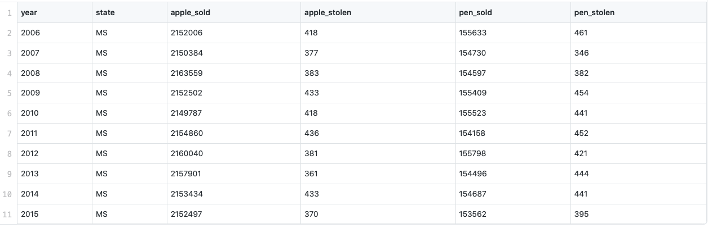

# Lomonosov Moscow State University
## Faculty of Computational Mathematics and Cybernetics

Computers for business Investigation of Operations
				STATE 3
Students 311 - 312 study groups
Volkova A., Kamkia N., Kozhukh P., Mirzoev S.

​

- Data preparation
- Loading data
- Table 1 creation
- Table 2 creation
- Table 3 creation
- Save results
